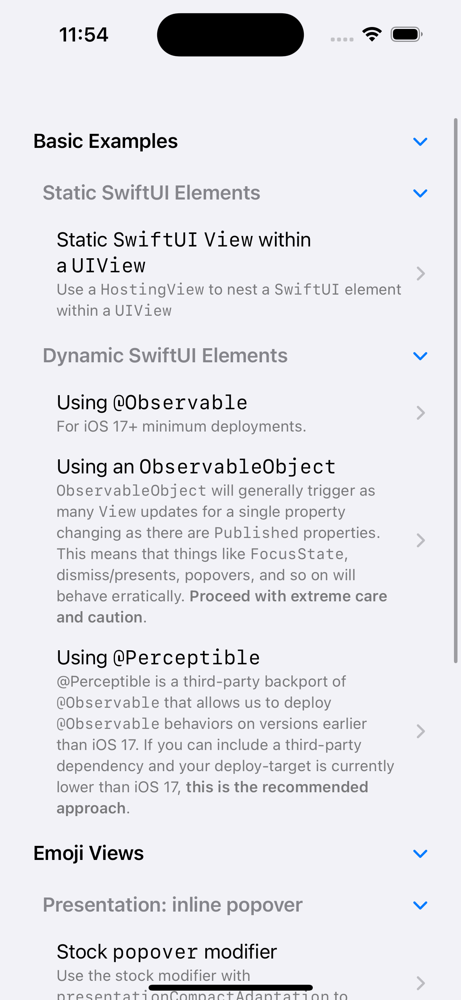
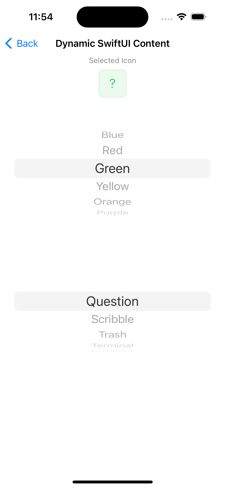
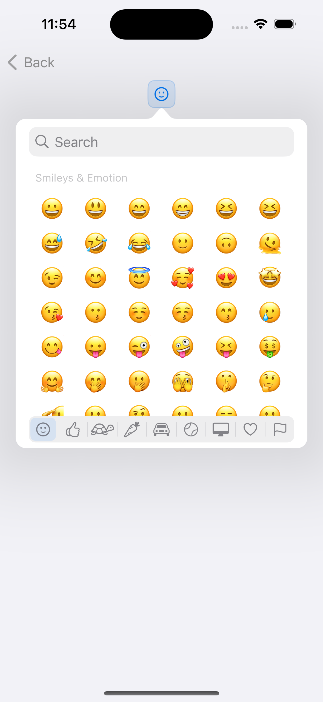
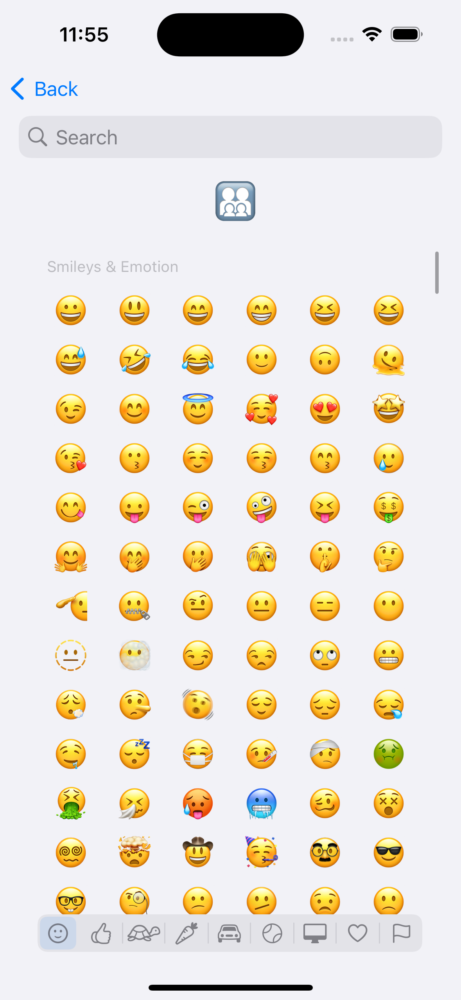

# HostingSample

HostingSample is an iOS project that provides examples and implementation for a custom view called HostingView. The purpose of HostingView is to facilitate the interoperability of SwiftUI views in UIKit-based apps. Developers can seamlessly integrate SwiftUI views directly within any UIView using HostingView.

## Usage

Using `HostingView` is straightforward. Here's a basic example of how to integrate a SwiftUI view into a UIKit-based project:

```swift
import UIKit
import SwiftUI

class MyViewController: UIViewController {
  override func viewDidLoad() {
    super.viewDidLoad()
    let hostingView = HostingView(rootView: MySwiftUIView())
    view.addSubview(hostingView)
    hostingView.translatesAutoresizingMaskIntoConstraints = false
    NSLayoutConstraint.activate([
      hostingView.topAnchor.constraint(equalTo: view.topAnchor),
      hostingView.leadingAnchor.constraint(equalTo: view.leadingAnchor),
      hostingView.trailingAnchor.constraint(equalTo: view.trailingAnchor),
      hostingView.bottomAnchor.constraint(equalTo: view.bottomAnchor)
    ])
  }
}

struct MySwiftUIView: View {
  var body: some View {
    Text("Hello, SwiftUI!")
      .font(.title)
      .padding()
      .background(Color.blue)
      .foregroundColor(.white)
      .cornerRadius(10)
  }
}
```

## Examples

| Example | Description | Preview |
| --- | --- | --- |
| Overview | An overview of the examples included in this project. |  |
| Static SwiftUI Elements | Demonstrates how to use static SwiftUI elements like `Text`, `Image`, and `Button`. |  |
| Dynamic SwiftUI Elements | Demonstrates how to use SwiftUI elements with dynamic values |  |
| Emoji Picker: Popover | Demonstrates how to present a custom emoji picker `UIViewController` as an inline popover. |  |
| Emoji Intensifies: Parallax | Demonstrates an example of a parallax effect on a selected emoji. |  |


This project includes a few examples to demonstrate the capabilities of `HostingView`. The examples are as follows:

- **Basic Example**: Demonstrates how to integrate a simple SwiftUI view into a UIKit-based project.
  - **Static SwiftUI Elements**: Shows how to use static SwiftUI elements like `Text`, `Image`, and `Button`.
    - **Static SwiftUI View within a UIView**: Use a `HostingView` to nest a SwiftUI element within a UIView.
  - **Dynamic SwiftUI Elements**: Shows how to use dynamic SwiftUI elements like `List` and `ForEach`.
    - **Using `@Observable`**: For iOS 17+ minimum deployments.
    - **Using an `ObservableObject`**: `ObservableObject` will generally trigger as many `View` updates for a single property changing as there are `Published` properties. This means that things like `FocusState`, dismiss/presents, popovers, and so on will behave erratically. **Proceed with extreme care and caution**.
    - **Using @Perceptible**: `@Perceptible` is a third-party backport of `@Observable` that allows us to deploy `@Observable` behaviors on versions earlier than iOS 17. If you can include a third-party dependency and your deploy-target is currently lower than iOS 17, **this is the recommended approach**.
- **Emoji Views**: These examples demonstrate how to use a custom Emoji Picker view – modeled after the iOS emoji keyboard – to select and display emojis in a mixed UIKit/SwiftUI environment. The `EmojiCollectionViewController` is the custom view controller that displays emojis and allows users to select them. This view is integrated into a SwiftUI `View` in order to build up a more complex UI. These SwiftUI `View`s are then integrated into a UIKit-based project using `HostingView`.
  - **Presentation: inline popover**: Demonstrates how to present the emoji picker as an inline popover.
    - **Stock `popover` modifier**: Use the stock modifier with `presentationCompactAdaptation` to display as a popover on iPhones. Available for iOS 16.4+ deployments.
    - **Custom `popover_backport` modifier**: Use the `popover_backport` modifier if your deploy target is less than iOS 16.4.
  - **Emoji Intensifies: Parallax**: Demonstrates an example of a parallax effect on a selected emoji.
    - **Animating Emojis, with selection**: On a device, this appears as a parallax effect. As we don't have data from `CoreMotion` on the simulator, we've mocked values coming from `CoreMotion` as random numbers over a range. The effect on a simulator is an "intensifies" animation. More importantly, this demo showcases how we can continue to utilize the `EmojiCollectionViewController`'s filtering even though we don't have access to its `searchController`.
